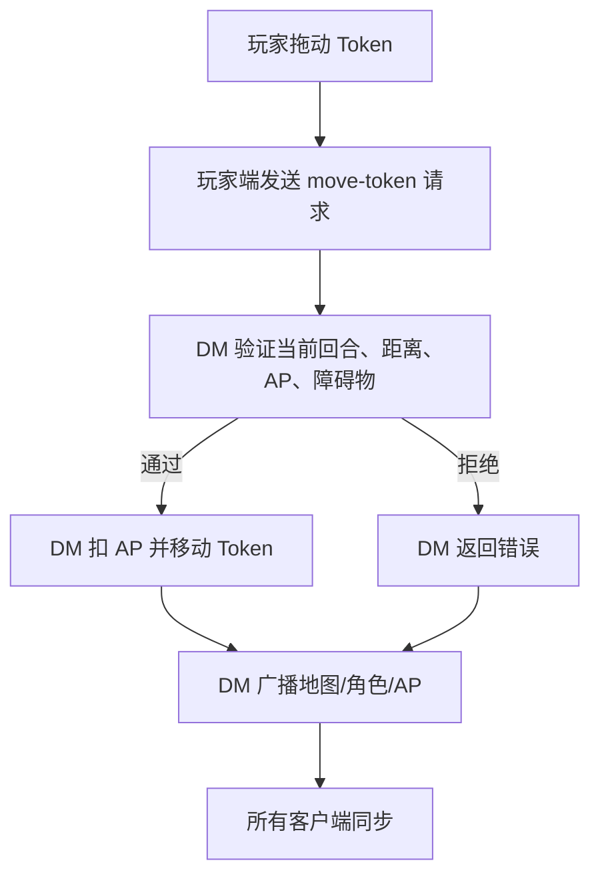

# 战斗结算阶段说明

本文描述当前代码中的战斗权威、广播职责、结算阶段，以及现有技能/特性应落在哪个阶段。当前实现已经把玩家单体攻击、玩家 AOE、敌人攻击接入 `CombatResolutionRunner` 的分阶段 session；大量具体规则仍保留在 `MapsPage.tsx` 的旧结算函数里，后续可以逐个迁移成 hook。

## 权威端

- DM 端是战斗状态权威端：AP、回合、怪物行动、伤害结算、死亡判定最终由 DM 端确认。
- 玩家端发起动作请求：移动、攻击、释放技能、结束回合等先发给 DM 端。
- 玩家端可以先做本地 UI 反馈，但如果 DM 端拒绝，应回滚。
- 骰子动画可以在玩家端或 DM 端发起，但用于结算的骰值必须进入 DM 端结算上下文，再由 DM 端广播最终状态。
- 广播消息应携带自增 id / action id，客户端丢弃旧消息和重复消息。

### 单一权威实现（T-P1-420，2026-06-23 决定 Option A）

历史上存在一个**从未在生产运行**的并行权威引擎 `src/lib/headlessDmCombatEngine.ts`：279 个单测验证的是它，而真正运行的是 `MapsPage.tsx` 的 live 结算路径（`applyDamageToToken` / `applyEnemyAttack` / `planEnemyTurn` / `nextRound` / `finishEnemyAttack` 等）。测试因此对实际行为给出**虚假信心**。

决定（owner xushenghui，Option A）：**删除该死引擎及其测试，以及 `combatAuthority.ts` 中仅被测试引用的 standalone 导出**（`startCombatAuthority` / `spendCharacterApAuthority` / `spendEnemyApAuthority` / `activateFeatureAuthority` / `moveCharacterAuthority` / `attackCharacterAuthority` / `applyDamageAuthority` / `resolveDodgeAuthority`）。**MapsPage live 路径是唯一权威**，覆盖通过把 live 纯核（DOT/状态/闪避判定）抽到 `lib/` 后单测保证。

唯一保留的 authority 触点是 **`executeCombatMutationsAuthority`**（MapsPage 在 :884 调用），它把 hook 输出的 `CombatMutation[]` 在 DM 端一次性权威执行（spend-ap/spend-qi/spend-feature-use/damage/heal/condition/log/custom）。

**状态时长叠加的唯一规则 = refresh-to-max**（再次施加取较大剩余回合，绝不硬覆盖向下）：
- `combatTokens.statusRefreshTokenPatch`（add 分支的规范实现，`executeCombatMutationsAuthority` 的 condition-add 走它）；
- MapsPage 内联的 `Math.max(...Turns ?? 0, n)` 与之同义；
- 清除（remove）分支单独硬置 `undefined`（0 stays 0，不复活已清状态）。

## 战斗阶段

阶段定义在 `src/lib/combatResolutionPipeline.ts`：

1. `actionDeclared`
   动作已声明。记录行动者、目标、技能、标签。适合做 AP/次数/距离/目标合法性检查，以及“当你被指定为目标时”的反应。

2. `beforeAttackRoll`
   命中骰、豁免骰或闪避骰之前。适合插入优势/劣势、替友方闪避、灵活身躯、精准打击这类改变判定的效果。

3. `attackRollResolved`
   D20 或自动命中结果已确定。适合触发“闪避成功后”“豁免成功后”“命中后但伤害前”的效果。

4. `beforeDamageRoll`
   伤害骰之前。适合替换伤害骰、追加伤害骰、把一次 AOE 设定为共享伤害骰。

5. `damageRolled`
   伤害骰已投出，尚未最终扣血。适合静心、狩猎印记、双箭、无声起弦、爆裂箭矢等追加骰或改公式的效果。

6. `beforeDamageApplied`
   最终扣血前。适合豁免半伤、攻防差值修正、抗性、减伤、临时生命吸收、心如止水抵消伤害。

7. `damageApplied`
   HP/临时 HP 已改变。适合“受到伤害后”“造成伤害后”触发，例如叠狩猎印记、失去静心层数、进入气喘。

8. `afterDamageApplied`
   伤害后状态和派生效果处理。适合穿甲箭溅射、曲终、眩晕/击飞/燃烧、CD 减少、击杀/濒死触发。

9. `actionResolved`
   动作完全结束。适合清理临时 buff、写 Log、广播最终状态、解锁下一动作。

## 当前代码入口

- 玩家单体攻击：`src/pages/MapsPage.tsx` 的 `resolveAttack`
- 玩家 AOE：`src/pages/MapsPage.tsx` 的 `resolveAoeAttack`
- 敌人攻击：`src/pages/MapsPage.tsx` 的 `finishEnemyAttack`
- 玩家移动请求：`handlePlayerActionRequest` 中的 `move-token`
- 敌人行动：`scheduleEnemyTurn`
- 回合推进：`advanceInitiativeCore`

## 移动流程

移动当前不走伤害阶段，但以后如果要接“离开威胁范围借机攻击”“移动后失去静心”，建议作为独立 `movementDeclared -> movementResolved` 管线，或在 `actionDeclared/actionResolved` 使用 `move` 标签。

## 玩家攻击流程

1. `actionDeclared`
   创建本次攻击 session，写入 actor、primaryTarget、skill、`player-action`、`attack`、`single-target` 或 `aoe-target` 标签。

2. `beforeAttackRoll`
   当前规则中，正常攻击通常不投命中骰；气喘、风痕贯射优势、安定心神暴击阈值等会进入 D20 判定。

3. `attackRollResolved`
   如果投 D20，记录骰值、属性调整、熟练、AC、命中、重击。
   如果不投 D20，记录自动进入伤害阶段的快照。
   敌人自动闪避也在这个阶段前后影响 `hit`。

4. `beforeDamageRoll`
   准备基础伤害骰：基础射击为 D8；技能使用配置的 damageCount/damageSides。

5. `damageRolled`
   当前仍在旧逻辑中追加骰和改总值，包括：
   - 静心：静心状态增加伤害骰。
   - 狩猎印记：攻击带印记目标额外 D8。
   - 双箭：基础射击启用后追加对应额外伤害。
   - 无声起弦：第一回合第一个行动者首次攻击追加伤害。
   - 爆裂箭矢：重击后追加火焰 D12，并叠火焰标记。
   - 踏风连踢/起飞/连续拳等：满足条件后追加伤害骰。
   - 魔法伤害技能：聚能射击、回流魔箭、破魔箭、爆裂箭按魔法伤害类型参与后续防御修正。

6. `beforeDamageApplied`
   当前处理：
   - 敏捷/体质/力量豁免造成半伤、无伤或附加状态。
   - 10-20 尺集束射击伤害减半。
   - 攻防差值修正。
   - 临时生命值吸收在角色扣血函数内处理。

7. `damageApplied`
   写入角色 HP、Token HP、临时 HP 变化，并触发死亡延迟处理。

8. `afterDamageApplied`
   当前处理：
   - 造成伤害后叠狩猎印记。
   - 狩猎印记达到 4 层时触发曲终。
   - 穿甲箭在重击后对目标后方直线范围造成半伤。
   - 击飞、眩晕、束缚、脆弱、燃烧等状态写入。
   - 部分技能命中后减少自身 CD。

9. `actionResolved`
   消耗技能 AP/次数，写战斗 Log，广播骰子结果，清理 targeting。

## 玩家 AOE 流程

AOE 有一个总 session，并且每个目标会复用 `resolveAttack` 走逐目标 session。

- `beforeDamageRoll`：只投一次共享伤害骰。
- `damageRolled`：共享骰值写入 AOE session。
- `beforeDamageApplied`：逐目标豁免、半伤、击飞等在目标结算中执行。
- `damageApplied`：汇总所有目标最终伤害。
- `afterDamageApplied`：统一处理击飞队列、CD 减少、状态附加。

当前应重点测试这些 AOE：

- 箭雨风暴：矩形 AOE，共享伤害骰，敏捷豁免半伤。
- 飞空连击：20 尺内指定点，10 尺半径，敏捷豁免半伤。
- 旋风飞腿：范围攻击不受气喘劣势影响，目标敏捷豁免，失败全伤并可击飞。
- 聚能射击：直线 AOE，魔法伤害，目标豁免影响伤害。

## 敌人攻击流程

敌人攻击由 DM 端本地执行。

1. `actionDeclared`
   记录敌人 token、目标 token、攻击类型。

2. `beforeAttackRoll`
   如果目标可闪避，等待玩家端确认；若确认闪避，玩家端投 D20 并把结果交给 DM。
   AOE 使用目标豁免 D20。

3. `attackRollResolved`
   写入闪避/豁免结果。`hit=true` 表示攻击最终命中或豁免未完全规避。

4. `beforeDamageRoll`
   敌人伤害骰动画播放前。

5. `damageRolled`
   敌人基础伤害骰和狩猎印记反噬等额外伤害进入快照。

6. `beforeDamageApplied`
   攻防差值修正、豁免半伤、临时生命值吸收前。

7. `damageApplied`
   DM 更新角色 HP/临时 HP 和 Token HP。

8. `afterDamageApplied`
   处理气喘/静心损失、死亡延迟、特性后续触发。

9. `actionResolved`
   写 Log、广播最终骰子和状态。

## 当前特性落点

| 特性 | 当前落点 | 说明 |
| --- | --- | --- |
| 静心 | `damageRolled`, `damageApplied` | 静心加伤害骰；移动/受伤导致静心层数变化或气喘。 |
| 狩猎印记 | `damageRolled`, `damageApplied`, `afterDamageApplied` | 攻击带印记目标加 D8；造成伤害后叠层；被带印记目标攻击时额外受 D4。 |
| 曲终 | `afterDamageApplied` | 印记叠到 4 层后造成力场伤害、眩晕、移除印记。 |
| 双箭 | `actionDeclared`, `damageRolled`, `actionResolved` | 激活消耗 AP/次数；基础射击追加伤害；攻击后清理 ready 状态。 |
| 穿甲箭 | `afterDamageApplied` | 基础射击重击后，以攻击线延长到目标后方 15 尺，对直线内敌对单位造成半伤。 |
| 精准打击 | `beforeAttackRoll`, `attackRollResolved`, `actionResolved` | 激活后下一次攻击强制重击，命中后消耗次数并清理状态。 |
| 无声起弦 | `damageRolled`, `actionResolved` | 第一回合先攻第一名的第一次攻击追加伤害，之后标记已使用。 |
| 波澜不惊 | `actionDeclared`, `damageApplied` | 战斗开始默认静心；静心/气喘切换时回血。 |
| 残影脱身 | `attackRollResolved` | 豁免成功后可释放准备好的飞空连击。 |
| 灵巧跳跃 | `attackRollResolved`, `actionResolved` | 闪避成功后可确认移动，不额外消耗 AP。 |
| 心如止水 | `beforeDamageApplied`, `actionResolved` | 静心时激活，友方获得临时生命并免气喘。 |
| 狩猎连击 | `beforeAttackRoll`, `damageRolled` | 对印记目标攻击加值、忽视闪避、暴击额外伤害。 |
| 爆裂箭矢 | `damageRolled`, `afterDamageApplied` | 重击追加火焰 D12 并叠火焰标记。 |
| 灵活身躯 | `beforeAttackRoll` | 消耗气为闪避或敏捷豁免加值。 |
| 安定心神 | `actionResolved` | 保持静心结束回合获得层数；消耗层数触发移动、暴击、减 CD、额外回合。 |

## 当前技能落点

| 技能 | 当前落点 | 说明 |
| --- | --- | --- |
| 基础射击 | `beforeDamageRoll`, `damageRolled` | D8 基础伤害，可被双箭、静心、狩猎印记等影响。 |
| 多重射击 | `damageRolled`, `afterDamageApplied` | 多箭/多段目标逻辑在旧代码中处理，需继续重点回归测试。 |
| 集束射击 | `beforeDamageApplied` | 10-20 尺伤害减半。 |
| 怒气爆射 | `beforeDamageApplied`, `afterDamageApplied` | 力量豁免、束缚、多目标效果在旧逻辑中处理。 |
| 起身踢 | `afterDamageApplied`, `actionResolved` | 倒地限定、命中后解除倒地、高阶免费移动。 |
| 爆裂踢 | `beforeDamageApplied`, `afterDamageApplied` | 单体钝击，3 级后体质豁免失败眩晕。 |
| 踏风连踢 | `damageRolled`, `afterDamageApplied` | 移动到终点攻击；目标击飞时额外 1D6；推动/撞墙/CD 效果在旧逻辑中处理。 |
| 旋风飞腿 | `beforeDamageApplied`, `afterDamageApplied` | AOE 敏捷豁免，失败全伤并击飞。 |
| 飞空连击 | `beforeDamageRoll`, `beforeDamageApplied` | 指定点圆形 AOE，共享伤害骰，敏捷豁免半伤。 |
| 箭雨风暴 | `beforeDamageRoll`, `beforeDamageApplied` | 矩形 AOE，共享伤害骰，敏捷豁免半伤。 |
| 聚能射击 | `beforeDamageRoll`, `beforeDamageApplied` | 直线 AOE，魔法伤害，紫色蓄力/飞箭动画。 |
| 回流魔箭 | `afterDamageApplied` | 命中/重击后选择技能 CD 减少。 |
| 破魔箭 | `damageRolled`, `afterDamageApplied` | 目标有魔法/状态时额外伤害、脆弱、移除增益、按移除数量减 CD。 |
| 影步穿射 | `afterDamageApplied`, `actionResolved` | 命中后移动，不触发借机，远距离优势。 |
| 影遁舞步 | `afterDamageApplied`, `actionResolved` | 移动穿过敌人，不触发借机，给踏风连踢视为击飞。 |
| 鹰击长空 | `damageRolled`, `afterDamageApplied` | 三段攻击、击飞伤害、击飞目标 CD 减少、5 阶击飞豁免劣势。 |

## 后续迁移建议

1. 把每个特性从 `MapsPage.tsx` 中抽成 `CombatResolutionHook`。
2. 把 hook 输出的 `CombatMutation` 统一交给 DM authority 执行，不允许 hook 直接改 store。
3. 给 interrupt 建立统一弹窗队列：玩家确认、DM 确认、超时兜底都走同一套 request/response。
4. AOE 不再让每个目标重新创建完整攻击 session，而是改成 AOE session 下的 target packet。
5. 移动也建立阶段管线，借机攻击、撤离、困难地形、静心损失都插到移动阶段。
